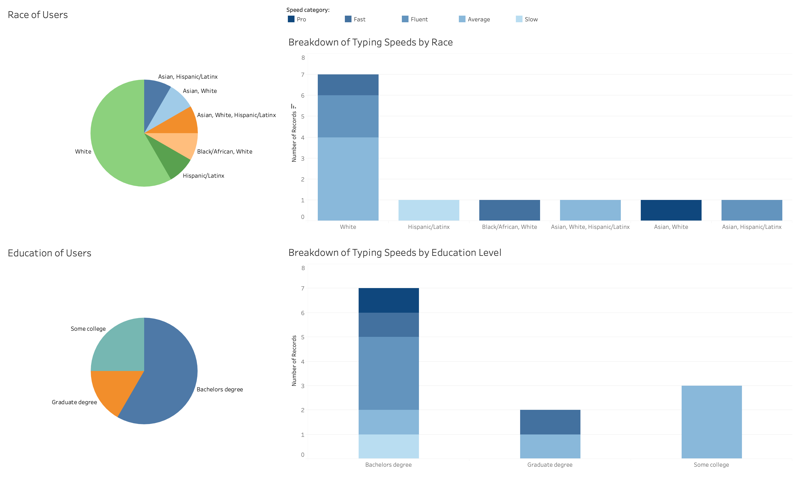
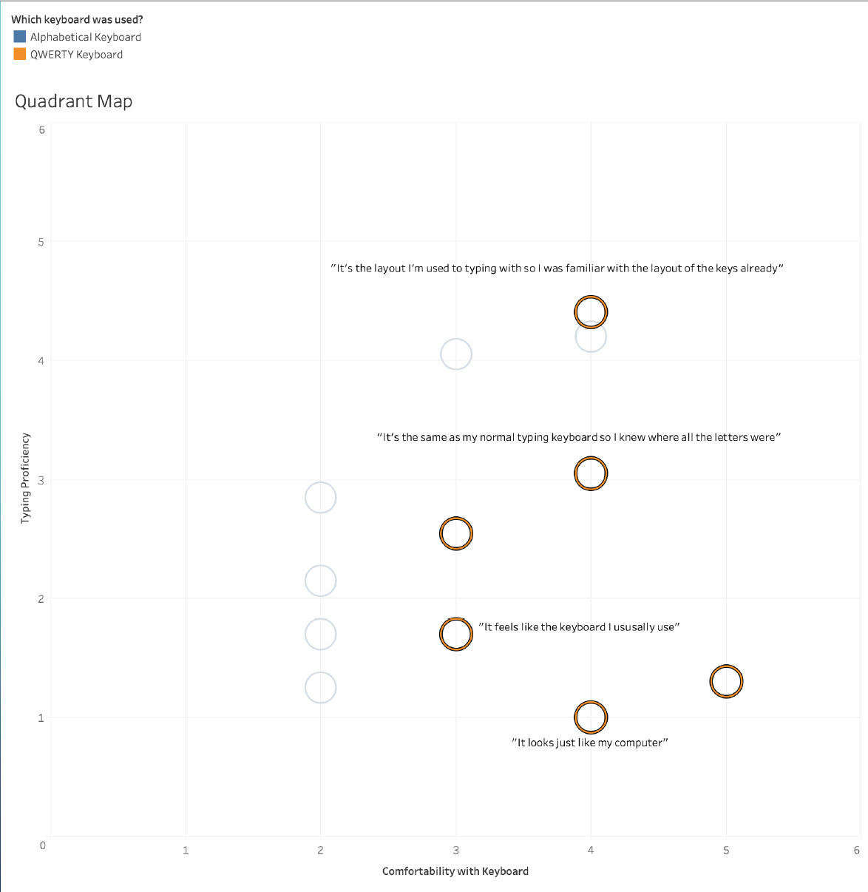
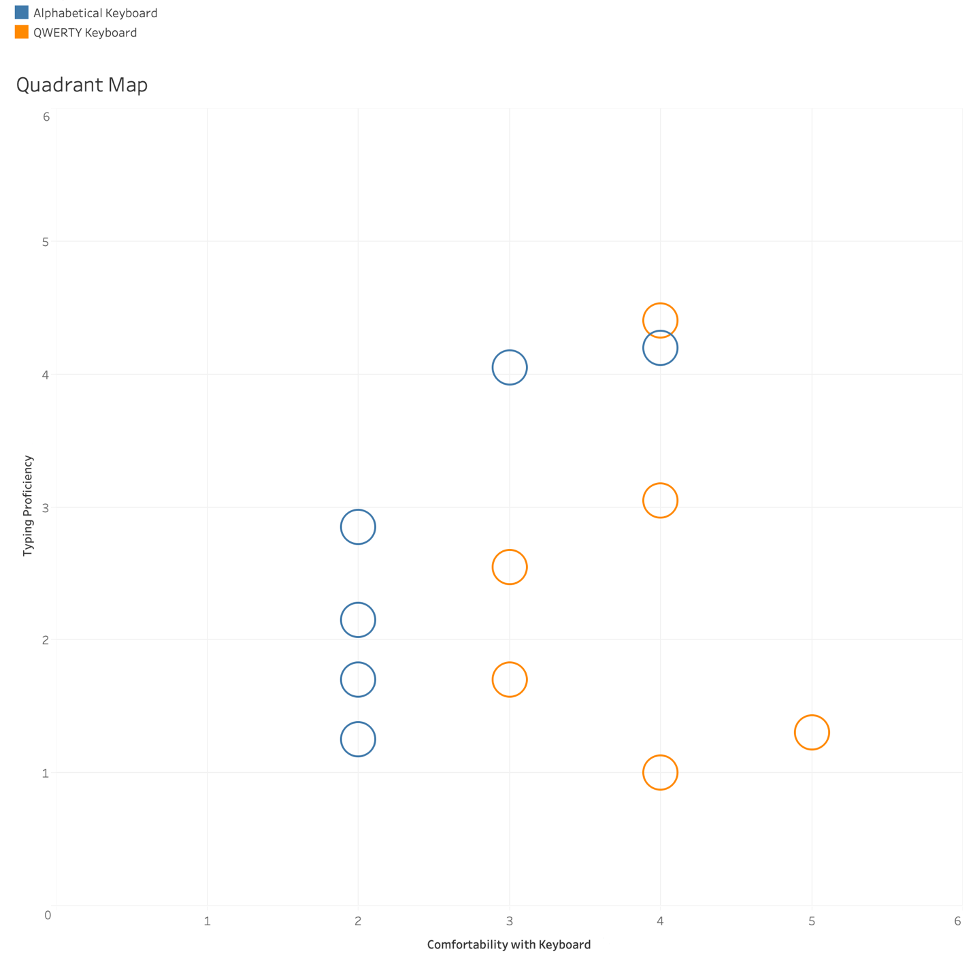

# TompkinsIS279

This repository is for Jake's final project in IS 279: User Experience Research course in the Department of Information Studies at UCLA.

## User Experience Research for the P300 Speller: Designing an Optimal Keyboard

### Executive Summary

After testing the P300 speller, Dr. Spier and the other researchers received feedback from users about their difficulties adjusting to the equipment. One subject admitted that they found it difficult to identify target letters on the alphabetical keyboard in time because they were more familiar with the QWERTY layout (Speier et al., 2015). This research project was designed to investigate the impact on a user’s experience of typing with QWERTY and alphabetical keyboards. A group of 12 users with varying typing proficiencies were individually evaluated using an adaptation of A/B and remote moderated testing via Zoom. A mixture of qualitative and quantitative data was collected and analyzed from each of these sessions. Using quadrant mapping and other data visualizations, these analyses support that QWERTY keyboard layouts streamlined the typing process and helped users feel more comfortable. It is recommended to replace the currently used alphabetical keyboard design on the P300 speller with a QWERTY styled keyboard instead. This recommendation could improve typing efficiency using the P300 speller BCI.

### Introduction

Brain-Computer Interfaces (BCI) are devices that make it possible for “locked-in” patients to operate computers through the evaluation of brain activity. This research focuses on one device in particular known as the P300 Speller. By evaluating electroencephalographic (EEG) activity through electrodes attached to the head, this device can invoke communicatory commands similar to that of typing. Users who have limited control of their body, such as those with amyotrophic lateral sclerosis (ALS) disease, could potentially use this technology to help them communicate. As Dr. Speier reports in his study, this technology lacks the levels of speed and accuracy that users would find desirable enough to actually use (Speier et al., 2015).

The goal of this project was to learn how users respond to and interact with different keyboard layouts and identify whether or not the current alphabetical keyboard used for the P300 Speller is optimal. Through contextual surveys and timed tasks, this research explored how quickly users could form words and sentences using different keyboard layouts. This research seeks to challenge the use of traditional QWERTY keyboards used in standard communication tools to evaluate its potential usefulness in communication devices like the P300 BCI technology. Institutional stakeholders for this project include the UCLA Department of Neurosurgery, UCLA Neuroscience Interdepartmental Program, UCLA Department of Bioengineering, and the UCLA Brain Research Institute. Any evidence resulting from this research that may contribute to the re-designing of the P300 speller would directly impact the financial and scholarly interest invested into this product by researchers from these institutions.

### Users and Recruitment

A digital screener using Google Forms was designed and then blasted on social media to identify research participants with a spread of typing proficiencies. Using the survey, I asked potential recruits to take a free online 1-minute typing test (www.typingtest.com) to learn and record information about their typing habits. This survey allowed me to remotely collect data on participants’ typing speed, proneness to errors, adjusted speed, accuracy percentage, demographic data, contact information, and consent to participating in the next phase of the research. Capturing this data helped me recruit diverse subjects for both of my subgroups, which included slow and fast typists. Once I received 40 responses to the screener, I selected 12 users to recruit for the A/B testing. I used the contact information recorded in the screener survey to perform cold calls for recruitment. Fortunately, all of the users I recruited for the A/B and remote moderated testing, that had consented to participating, followed through with their session. I did not experience any no-shows.

### Research Logistics

Given the shelter-in-place orders, I successfully conducted each of the A/B remote moderated sessions via Zoom. These sessions were completed with users in their home locations. I decided on these evaluative methods because they enabled me to collect data remotely, fit the number of users I planned to recruit, and most clearly addressed the design question I was asking. However, these methods deviated from “best practice” UX strategies because they were executed through a remote environment instead of directly in person. These sessions were completed over the span of a week, with about two 15-20 minute sessions per day. I spent approximately a total of 3 hours with users. Prior to their session, users were sorted by their typing speed into either a slow or fast typing category, then each group was equally split between using the “alphabetical” keyboard and the traditional “QWERTY” layout, mocking the A/B strategy.

### Changes from Initial Research Proposal

My research proposal initially called for the recruitment of 20 participants for the A/B remote moderated testing. However, Professor Zide encouraged me to reduce my number of participants to a more manageable size that better fit the timeline of the project. In response to her feedback, I decided to move forward with only 12 participants. I also intended to modify the A/B testing so that users would interact with both designs and complete 5 different activities. With this approach, I was concerned that users would perform better on the second test because of their experience with completing tasks the first time around. To avoid skewed results, I decided to reduce the number of typing tasks to 3 instead of 5 and split each subgroup of typing speeds in half, assigning one group the alphabetical keyboard only and the other group the QWERTY keyboard only. This method was used as opposed to having every user interact with both keyboards. Lastly, my proposal stated that I would use the data collected from these sessions to create user personas, but after conferring with Professor Zide, I decided to move forward with quadrant mapping instead. I used the data collected on participant’s typing habits and contextual inquiry data points from interviewing users after they completed tasks using the keyboard. The data collected from the A/B and remote moderated testing were more informative for quadrant mapping and less conducive for building data-driven user personas like I had originally planned.

### Research methods

With verbal consent from each participant, every session was recorded using the built-in Zoom feature. After the recording began, users were instructed to navigate to the website (https://mottie.github.io/Keyboard/index.html) allowing them to use a virtual keyboard simulator. Depending on whether they belonged to the “alphabetical” or “QWERTY” group, users were instructed to open the specific keyboard layout they were assigned. I gave users detailed instructions that they would be timed to perform three typing tasks by navigating the virtual keyboard with their mouse. Each task consisted of a short phrase read aloud to each participant. Users were asked to retype the phrases using their mouse to point and click on each character using the virtual keyboard.

The first task asked users to type the phrase “quit bothering me while I’m reading.” The following task asked users to type the phrase “my favorite color is orange.” Finally, the third task asked users to type the phrase “thank you very much for coming.” To standardize results as best as possible, I explicitly told users to exclude punctuation and avoid capitalization when typing out the phrase. This research was only concerned about users identifying the target letter they needed to spell the phrases out correctly. After each session, I went back to the recording and used a stopwatch to time the number of seconds it took the user to complete each task. The stopwatch began after the first letter was typed and stopped after the final letter was typed, which kept data collection consistent across users.

In conclusion to the session, each user was asked a few brief questions about their experience performing the activities using their assigned keyboard. The first question asked users to rank how comfortable they felt using their assigned keyboard to perform the typing activities. This data was ranked using a Likert scale from 1 (very uncomfortable) to 5 (very comfortable). Next, the user was asked if they found the layout of the keyboard confusing by answering either “yes” or “no.” For contextual inquiry, users were asked to provide more information about why they selected their answers. Each of these data points were collected and submitted using a Google Form, including the user’s name and the keyboard they used. This process streamlined data cleanup and made analysis much easier. The dataset from the A/B remote moderated tests was merged with the screener dataset, which captured the demographic data and typing habits data collected on participants in the first phase of the research.

**Figure X**

*Demographic Data*

### Data Analysis

Data from this research was collected using Google Forms, which significantly simplified the process of exporting data into a CSV format. Once in a CSV format in Google Sheets, I was able to connect the live data to a visualization tool. The tool used for this analysis and data visualization was Tableau. Using a VLOOKUP function, I was able to merge data from the A/B test with other data collected from the screener tool by connecting data points to the names of each participant. Once a master dataset was complete, I was able to begin my analysis.

The first analysis I conducted with the data was a quadrant map that illustrated the relationship between the typing speed of users and the rating they gave for the keyboard they used. Using a 5x5 grid, users were plotted to identify any patterns in their data. Along the y-axis, the typists were plotted based on their speeds, starting with 1 as the slowest and then progressing to 5 as the fastest. For the x-axis, I started with 1 being the least comfortable and moving towards 5, which was the most comfortable. Once each of the 12 participants were plotted on the quadrant map based on their data, they were color coordinated to identify which keyboard they used.

**Figure X**

*Alphabetical Keyboard Results*

**Figure X**

*QWERTY Keyboard Results*

With all users plotted on the quadrant map, I pulled direct quotes from the contextual inquiry process and attached them to the user’s data point on the map. The most common user feedback given after using the QWERTY keyboard was that they were “used to” this keyboard. Other meaningful quotes included: “it’s just like the keyboard I use on my computer” or “my muscle memory usually helps with my typing.” Users from the alphabetical keyboard group gave feedback like “the letters weren’t in the correct spots” and “I kept going back to the QWERTY keyboard.” I wanted to document these quotes with the plots on the quadrant map to give more context about the users and their experience with the keyboard they used.

**Figure X**

*Quotes from Alphabetical Keyboard Users*

**Figure X**

*Quotes from QWERTY Keyboard Users*

A relationship became apparent from the quadrant map, indicating that an overwhelming majority of users who completed the typing activities using the alphabetical keyboard layout felt less comfortable than the users who were assigned the QWERTY keyboard. This relationship is apparent across the spread of different typing speeds. Additionally, users were asked a “yes” or “no” question to gauge whether or not they found the keyboard layout confusing. While the QWERTY keyboard users unanimously agreed the keyboard was not confusing, exactly 50% of users who were assigned the alphabetical keyboard indicated they felt it was confusing to use.

**Figure X**

*Contextual Survey Responses*

The quantitative data collected from the timed tasks was evaluated using a series of bar graphs. A bar graph was produced for each task, then distinguished between the two keyboard types. With each bar representing an individual user, different colors were used to identify the different speed category they belonged in. Evaluating each task broken down by keyboard type, a pattern emerges showing that, despite differing typing speeds among users, those who completed tasks using the QWERTY keyboard typically took less time than users who completed the same tasks using an alphabetical keyboard. It is important to acknowledge the potential outlier in the timed task analysis data. One user took an unusual amount of time to complete each of the tasks; therefore, any insights drawn from this data point are speculative.

**Figure X**

*Timed Task Results*

### Research Findings

The qualitative data collected from interviewing users suggests that the preferred keyboard for typing is the traditional QWERTY layout (Figure 1). According to the feedback received by users, this keyboard is more comfortable to operate. This claim is supported by the quantitative data from the timed tasks. Evaluating this data made it clear that, despite the range of typing speeds, users who typed using the QWERTY keyboard were typically able to identify target letters much quicker than the individuals using the alphabetical keyboard layout. According to users interviewed from this research, it is better to offer equipment that feels familiar, which can improve their confidence and ability to complete tasks.  

**Figure X**

*Quadrant Map*

Being mindful of the user experience and using a human-centered approach in designing the P300 Speller equipment, it is critical that the device feels native and comfortable to use. This research successfully identified an opportunity to remodel the interface of the P300 Speller and potentially improve the speed and accuracy in which users can identify target letters and effectively communicate, rendering the device much more useful for “locked-in” patients to use.

### Recommendations

While the current keyboard layout of the P300 Speller has proven to successfully help patients communicate, I believe a redesign of the alphabetical keyboard to model after the traditional QWERTY layout would improve the user’s experience of identifying target letters and communicating efficiently. Although the QWERTY keyboard layout may help users identify target letters much easier, there are other limitations associated with the design of the P300 Speller keyboard. The rows and columns of the keyboard flash to signal neural responses for the user’s electroencephalogram (EEG) to simulate keyboard input (Speier et al., 2015). The adoption of the QWERTY layout may increase the amount of time necessary for these cycles of flashes to detect the desired character that a user is trying to input. Further research with the actual P300 device would be necessary to conclude whether or not the QWERTY keyboard layout is more profitable to use.  

As identified in the study by Dr. Speier, the P300 Speller device has proven to be unsatisfactory in speed and accuracy. These drawbacks discourage patients from electing to use the equipment as an alternative communication device. However, by reconsidering the design of the keyboard interface used for the P300 speller, users could potentially feel more comfortable using the device to type faster and more accurately. With a better understanding of how the configuration of letters on the keyboard impact the user experience, researchers can identify new design solutions for Brain-Computer Interfaces that make them feel more familiar and therefore more practical for patients to use.

### References

Speier, W., Arnold, C., Deshpande, A., Knall, J., & Pouratian, N. (2015). Incorporating advanced language models into the P300 speller using particle filtering. Journal of Neural Engineering, 12(4), 046018. https://doi.org/10.1088/1741-2560/12/4/046018
